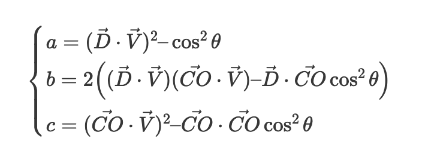

PAS OP

Omdat normalize_vector nu met een pointer werkt wordt de cylinder orientation genormaliseerd en overschreven
want object cylinder komt functies binnen als pointer (zie i_cylinder.c)

D = ray direction

V = cone orientation

C = cone center (which is the tip point)

O = ray origin

CO = O - C

    t_vec3  pdp = vec3_subtract(cp.direction, cp.position);
    t_vec3  eyexpdp = vec3_cross(vec3_subtract(r.origin, cp.position), pdp);
    t_vec3  rdxpdp = vec3_cross(r.direction, pdp);
    float   a = vec3_dot(rdxpdp, rdxpdp);
    float   b = 2 * vec3_dot(rdxpdp, eyexpdp);
    float   c = vec3_dot(eyexpdp, eyexpdp) - (cp.radius * cp.radius * vec3_dot(pdp, pdp));
    double  t[2];
    double delta;

	// https://www.gamedev.net/forums/topic/467789-raycylinder-intersection/

	//--------------------------------------------------------------------------
	// Ray : P(t) = O + V * t
	// Cylinder [O, D, r].
	// point Q on cylinder if ((Q - O) x D)^2 = r^2
	//
	// Cylinder [A, B, r].
	// Point P on infinite cylinder if ((P - A) x (B - A))^2 = r^2 * (B - A)^2
	// expand : ((O - A) x (B - A) + t * (V x (B - A)))^2 = r^2 * (B - A)^2
	// equation in the form (X + t * Y)^2 = d
	// where : 
	//  X = (O - A) x (B - A)
	//  Y = V x (B - A)
	//  d = r^2 * (B - A)^2
	// expand the equation :
	// t^2 * (Y . Y) + t * (2 * (X . Y)) + (X . X) - d = 0
	// => second order equation in the form : a*t^2 + b*t + c = 0 where
	// a = (Y . Y)
	// b = 2 * (X . Y)
	// c = (X . X) - d
	//--------------------------------------------------------------------------
	// A = cylinder center   B = centre punt van de cap van de cylinder
	// Vector AB = (B - A); 		== cylinder orientation
	// Vector AO = (O - A);			== cyl center to origin	
	// Vector cross2 = (AO ^ AB); 
	// cross product Vector cross1  = (V ^ AB); 
	// cross product float  ab2   = (AB * AB); 
	// dot product float a      = (cross1 * cross1); 
	// dot product float b      = 2 * (cross1 * cross2);
	// dot product float c      = (cross2 * cross2) - (r*r * ab2);
	// solve second order equation : a*t^2 + b*t + c = 0